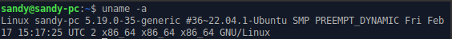

# Workshop Administrasi Jaringan

#### 1

#### 2
- / (root)
Partisi dimana di letakkan / (root system) akan menjadi direktori sistem atau partisi pokok.
- /boot
Direktori boot tesimpan file-file boot loader diantaranya grub atau lilo.
- /sys
Berisi informasi yang berkaitan dengan kernel, device dan firmware.
- /sbin
Berisi file-file biner yang esensinya untuk sistem dan mengendalikan sistem.
- /bin
Berisi file-file binari atau aplikasi yang lebih umum dan dapat digunakan oleh semua user
- /lib
Berisi file-file library atau pustaka dari semua aplikasi binari yang tersimpan dalam direktori /sbin dan /bin.
- /dev
Merupakan pseudo filesystem, atau directory yang isinya sebenarnya bukan benarbenar berisi file.
- /etc
Direktori /etc berisi file-file konfigurasi sistem
-/home
Semua direktori home dari pengguna tersimpan di direktori ini dengan nama user masing-masing sebagai pengelompokannya
- /media
Merupakan direktori untuk menyimpan direktori-direktori mount point.
- /mnt
Pada Linux yang masih umum menggunakan kernel 2.4.x. Untuk tempat mengumpulkan mount point berada di /mnt.
- /opt
Direktori /opt saat ini jarang digunakan. Beberapa paket software terpisah menggunakan direktori untuk menyimpan paket yang menuju ke lokasi manapun.
- /usr
Sebuah sub-hirarki dari root filesistem di simpan didalam /usr
- /root
Merupakan direktori home-nya superuser (root).
- /var
Direktori /var merupakan direktori yang isinya sangat dinamis.
- /proc
Direktori /proc juga merupakan pseudo filesystem yang mirip dengan /dev.
- /tmp
Merupakan file sistem yang menyimpan file-file sementara.
- /lost+found
Di direktori ini linux menyimpan file-file yang berasil di recover saat sistem crash.

#### 3
"su" (atau "switch user") digunakan untuk mengubah identitas pengguna menjadi akun superuser atau akun lain, sementara "sudo" (atau "superuser do") digunakan untuk menjalankan perintah tertentu sebagai akun superuser atau akun lain tanpa perlu masuk ke dalam akun superuser secara langsung.

Saat menggunakan perintah "su", pengguna harus memasukkan kata sandi untuk akun superuser atau akun lain yang dituju. Namun, saat menggunakan perintah "sudo", pengguna diminta untuk memasukkan kata sandi mereka sendiri untuk memverifikasi identitas mereka sebelum menjalankan perintah.

Penggunaan "sudo" lebih aman daripada "su" karena tidak memerlukan pengguna untuk masuk ke dalam akun superuser secara langsung. Ini membatasi potensi kerusakan atau kesalahan yang dapat terjadi saat menggunakan akses superuser.

#### 4
- Main
Ketika Anda menginstal Ubuntu, ini adalah repositori yang diaktifkan secara default. Repositori utama hanya terdiri dari FOSS (free and open source software) yang dapat didistribusikan secara bebas tanpa batasan apa pun.

Perangkat lunak dalam repositori ini didukung sepenuhnya oleh pengembang Ubuntu. Inilah yang akan disediakan oleh Ubuntu dengan pembaruan keamanan hingga sistem Anda mencapai akhir masa pakainya.

- Universe
Repositori ini juga terdiri dari perangkat lunak free dan open source, tetapi Ubuntu tidak menjamin update keamanan reguler untuk perangkat lunak dalam kategori ini.

Perangkat lunak dalam kategori ini dikemas dan dikelola oleh komunitas open source. Repositori Universe memiliki sejumlah besar perangkat lunak open source dan karenanya memungkinkan Anda untuk memiliki akses ke sejumlah besar perangkat lunak melalui apt package manager.

- Multiverse
Multiverse berisi perangkat lunak yang bukan FOSS. Karena masalah lisensi dan hukum, Ubuntu tidak dapat mengaktifkan repositori ini secara default dan tidak dapat menyediakan perbaikan dan pembaruan.

Terserah Anda untuk memutuskan apakah Anda ingin menggunakan repositori Multiverse dan memeriksa apakah Anda memiliki hak untuk menggunakan perangkat lunak.

- Restricted
Ubuntu mencoba menyediakan hanya perangkat lunak free dan open source, tetapi itu tidak selalu mungkin khususnya ketika menyangkut perangkat keras pendukung.

Repositori terbatas yang terdiri dari driver berpemilik. Pembaruan dan Penambalan bug dilakukan oleh perusahaan atau pemegang hak milik dari software.

- Partner
Repositori ini terdiri dari perangkat lunak berpemilik yang dipaket oleh Ubuntu untuk mitra mereka. Sebelumnya, Ubuntu digunakan untuk menyediakan Skype melalui repositori ini.

- Repository Pihak Ketiga dan PPA (Tidak disediakan oleh Ubuntu)
Lima repositori di atas disediakan oleh Ubuntu. Anda juga dapat menambahkan repositori pihak ketiga (jika ingin melakukannya) untuk mengakses lebih banyak perangkat lunak atau mengakses versi perangkat lunak yang lebih baru (karena Ubuntu mungkin menyediakan versi lama dari perangkat lunak yang sama).

#### 5
"apt install" digunakan untuk menginstal paket baru pada sistem. Perintah ini akan mengunduh paket yang diperlukan dari repositori, menyelesaikan dependensi, dan menginstal paket pada sistem.

"apt reinstall" digunakan untuk memperbarui paket yang sudah terinstal pada sistem. Perintah ini akan mengunduh paket terbaru dari repositori dan memperbarui paket yang sudah terinstal.

"apt remove" digunakan untuk menghapus paket yang sudah terinstal pada sistem. Perintah ini akan menghapus paket dan file konfigurasi yang terkait dengan paket, tetapi tidak akan menghapus file atau data yang dibuat oleh pengguna.

"apt purge" digunakan untuk menghapus paket yang sudah terinstal beserta file konfigurasi yang terkait dengannya. Perintah ini akan menghapus semua file, data, dan konfigurasi yang terkait dengan paket dan mengembalikan sistem ke kondisi sebelum paket diinstal.